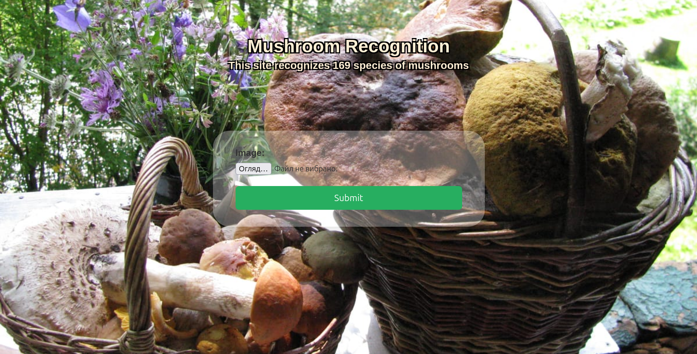
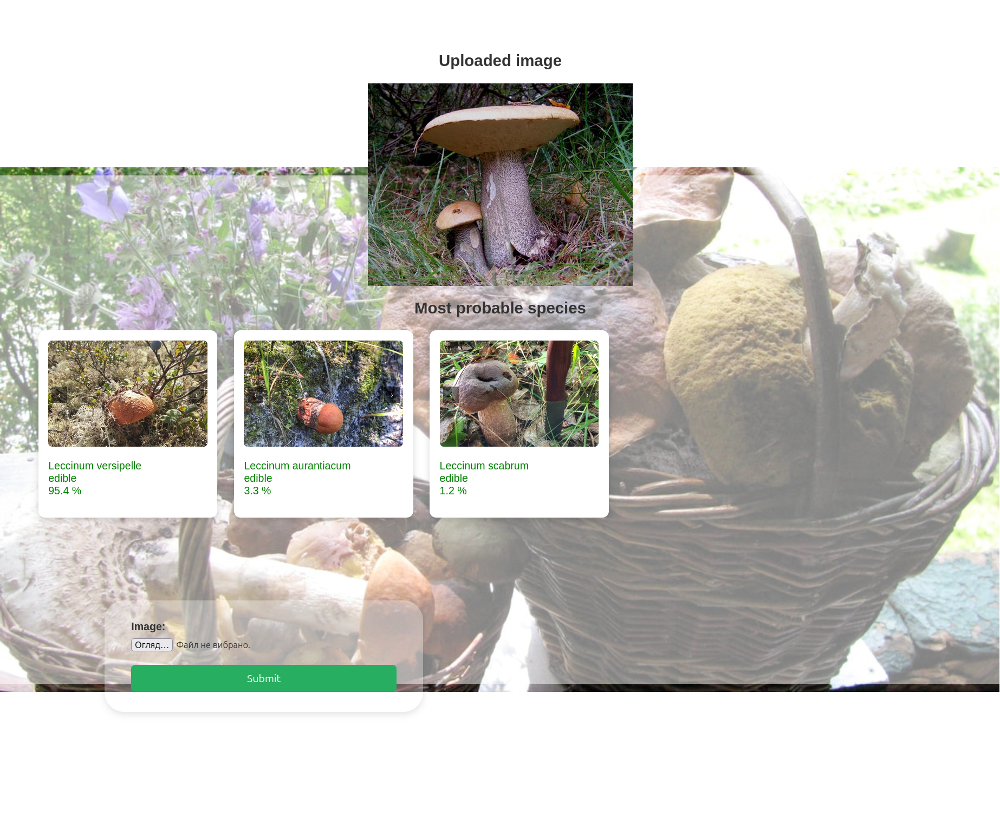
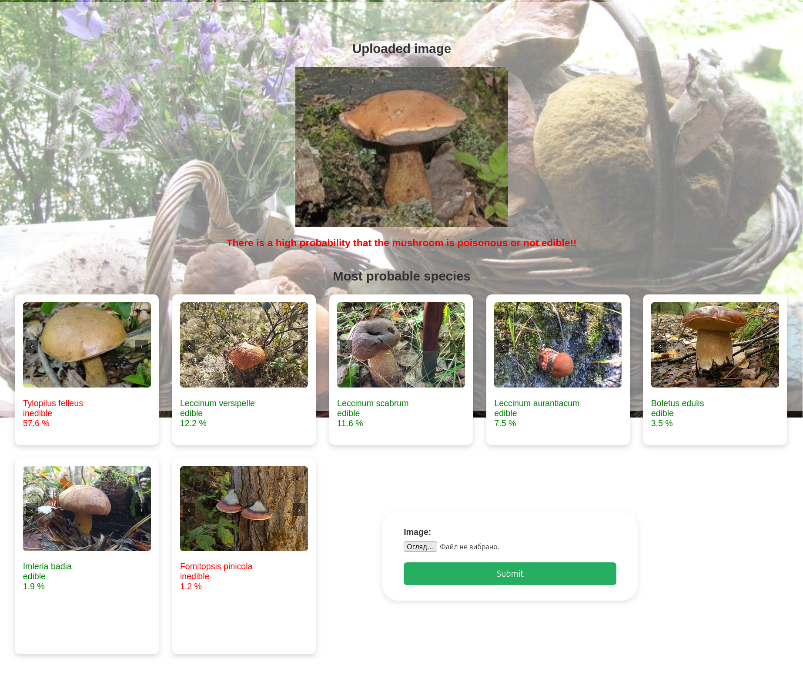

# mushroom-recognizer
A web application capable of recognizing 169 species of mushrooms using a neural network.

🍄 Mushroom Recognizer: Deep Learning Web App

An intelligent mushroom identification system powered by EfficientNetV2. This project provides a full-stack solution: from a high-accuracy neural network trained on a massive dataset to a modular Flask web application for real-time inference.
🚀 Key Features

    169 Species Classification: High-granularity recognition using State-of-the-Art CNN.

    Probability Filtering: Displays only results with > 1% confidence to minimize noise.

    Visual Verification: Integrated carousel to compare user photos with original dataset samples.

    Safety First: Automatic edibility labeling and cumulative risk assessment for non-edible species.

    Production Architecture: Decoupled settings, environment-based secrets, and modular inference logic.

🧠 Machine Learning & Data
Model Insights

    Architecture: EfficientNetV2-B0 (Transfer Learning).

    Techniques: Fine-tuning, Batch Normalization, and Dropout (0.3).

    Augmentation: Built-in layers for Rotation, Zoom, and Contrast to handle diverse real-world photos.

    Accuracy: Achieved a stable ~82% validation accuracy.

Resources

Dataset: https://www.kaggle.com/datasets/zlatan599/mushroom1

Training Notebook: https://colab.research.google.com/drive/1EnPy50DWmuoCmPe9hciDzyL5sOGv7NCV#scrollTo=A27lIIv4o9dQ — Explore the training process, data augmentation, and evaluation metrics.

📂 Project Structure
```
mushroom-recognizer/
├── app/                        # Flask Web Application
│   ├── static/                 # CSS, JS, and Reference Images
│   │   ├── images/merged_dataset/ # Dataset samples for UI comparison
│   │   └── js/carousel.js      # Image comparison logic
│   ├── templates/              # Jinja2 HTML layouts
│   ├── app.py                  # Web entry point
│   └── utils.py                # Helper functions (image validation, etc.)
├── prediction/                 # AI Inference Logic
│   ├── static/models/          # .keras model files
│   └── predict.py              # Model loading and classification
├── .env.example                # Template for environment variables
├── settings.py                 # Centralized configuration loader
├── mushrooms_names.pickle      # Metadata (Names)
├── requirements.txt            # Project dependencies
└── README.md                   # Documentation
```
⚙️ Configuration & Security

The project uses a settings.py hub and .env files to keep sensitive data (like SECRET_KEY) out of the codebase.

Clone the Repo:
```
git clone https://github.com/Roman-Sokolov-V/mushroom-recognizer
cd mushroom-recognizer
```
Environment Setup:
```
cp sample_env .env
```
Edit .env with your FLASK_SECRET_KEY

💻 Installation & Launch
1. Install Dependencies
```
pip install -r requirements.txt
```
2. Run the Application
```
flask --app app/app run
```

Then, open your browser at: http://127.0.0.1:5000
🖼 Examples & UI
### Main page


### Recognition result


⚠️ Safety Disclaimer

IMPORTANT: This application is for educational purposes only.

    AI models can make mistakes. Never consume wild mushrooms based solely on this app's output.

    Misidentification of fungi can lead to severe poisoning or death.

    Always consult with a professional mycologist.

Author: Roman Sokolov

Project Link: https://github.com/your-username/mushroom-recognizer
